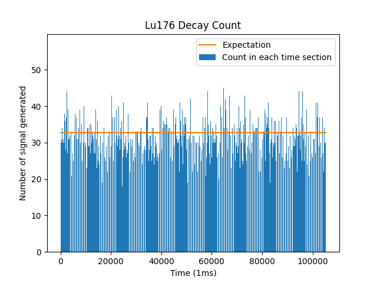

# Homework 1

Author: Wang Haozhe

Date: 2024/3/13

## File Tree
```
.
├── Graph
│   ├── LYSO_100us.png
│   ├── LYSO_1ms.png
│   ├── LYSO_diff.png
│   ├── h-t-h.png
│   └── h-t-t.png
├── Homework1.md
├── LYSO.py
├── LYSO_3.py
├── LYSO_ttt.txt
└── coin_tossing.py
```

## Problem 1 - Coin Tossing

### Code:
```python
#!/usr/local/bin/python3.11
# -*- coding: UTF-8 -*-
# @Project : Statistic
# @File    : coin_tossing.py
# @Author  : Albert Wang
# @Time    : 2024/3/13
# @Brief   : None

import random
import numpy as np

from matplotlib import pyplot as plt

attempt = 10000000
total_try = 0
log_table = {}

for i in range(attempt):
    temp = [2, 2, 2]
    this_try = 0
    while temp != [1, 0, 1]:
        # Shift temp
        temp[0] = temp[1]
        temp[1] = temp[2]
        temp[2] = random.randint(0, 1)
        this_try += 1

    total_try += this_try

    # Add data into log_table
    if this_try in log_table:
        log_table[this_try] += 1
    else:
        log_table[this_try] = 1

# Calculate the average try
average_try = total_try / attempt
print(average_try)

# Sort the log_table from min to max
sorted_log = dict(sorted(log_table.items()))
x_ = np.array(list(sorted_log.keys()))
n_ = np.array(list(sorted_log.values()))
print(x_)
print(n_)

# Plot histogram
fig, ax = plt.subplots()
plt.xlabel("Number of coins")
plt.ylabel("Number of times")
plt.title("Coin Tossing (Head-Tail-Head)")
ax.bar(x_, n_)
plt.show()

# Calculate the possibility of at least 50 tries
in_fifty = 0
for i in range(50):
    if i in log_table:
        in_fifty += log_table[i]
print((attempt - in_fifty) / attempt)
```

### Q1.
#### Head-Tail-Tail:

$Average: 7.998652$

#### Head-Tail-Head:

$Average: 10.0005984$

### Q2.
#### Head-Tail-Tail:
Experiment value:

$
P(X=3) = 1249698/1e7 = 12.50\%  \\
P(X=4) = 1251769/1e7 = 12.52\%  \\
P(X=5) = 1249979/1e7 = 12.50\%  
$

Theoretical value:

$
P(X=3) = (1/2)^3 = 12.50\%  \\
P(X=4) = (1/2)^3 = 12.50\%  \\
P(X=5) = (1/2)^3 = 12.50\%  
$

#### Head-Tail-Head:
Experiment value:

$
P(X=3) = 1247789/1e7 = 12.50\% \\
P(X=4) = 1249795/1e7 = 12.50\% \\
P(X=5) = 938994/1e7 = 9.39\%
$

Theoretical value:

$
P(X=3) = (1/2)^3 = 12.50\%  \\
P(X=4) = (1/2)^3 = 12.50\%  \\
P(X=5) = 3/4 \cdot (1/2)^3 = 9.375\%  
$

### Q3.

#### Head-Tail-Tail:
$
P(X \geq 50) = 5.68 \times 10^{-5}
$

#### Head-Tail-Head:
$
P(X \geq 50) = 0.003
$

## Problem 2 - LYSO

### Code:
```python
#!/usr/local/bin/python3.11
# -*- coding: UTF-8 -*-
# @Project : Statistic
# @File    : LYSO.py
# @Author  : Albert Wang
# @Time    : 2024/3/13
# @Brief   : None

import numpy as np

from matplotlib import pyplot as plt

reload = 5e4  # 0.1ms * 500M
data = np.loadtxt("LYSO_ttt.txt", int)  # Load file
count = []
tail = 0

# Calculate total num in each group
for i in range(data.shape[0]):
    if data[i] - data[tail] > reload:
        count.append(i - tail)
        tail = i
print(len(count))

# Plot count
plt.xlabel("Time (0.1ms)")
plt.ylabel("Number of signal generated")
plt.title("Lu176 Decay Count")
plt.bar(np.linspace(1, len(count), len(count)), np.array(count), color="#1f77b4", label="Count in each time section")
# Plot expection
plt.plot([0, len(count)], [3.279, 3.279], color="#ff7f0e", label="Expectation")

plt.legend()
plt.show()
```

### Q1.


### Q2.


### Q3.
#### Code
```python
#!/usr/local/bin/python3.11
# -*- coding: UTF-8 -*-
# @Project : Statistic
# @File    : LYSO_3.py
# @Author  : Albert Wang
# @Time    : 2024/3/13
# @Brief   : None

import numpy as np

from matplotlib import pyplot as plt

data = np.loadtxt("LYSO_ttt.txt", int)  # Load file

# Calculate the time difference
diff = []
for i in range(int(np.shape(data)[0]) - 1):
    diff.append(0.002 * np.array(data[i + 1] - data[i]))

# Plot histogram
plt.bar(np.linspace(1, len(diff), len(diff)), np.array(diff))
plt.ylabel("Time difference of signal generated (us)")
plt.title("Lu176 Decay Time Difference")
plt.show()
```
