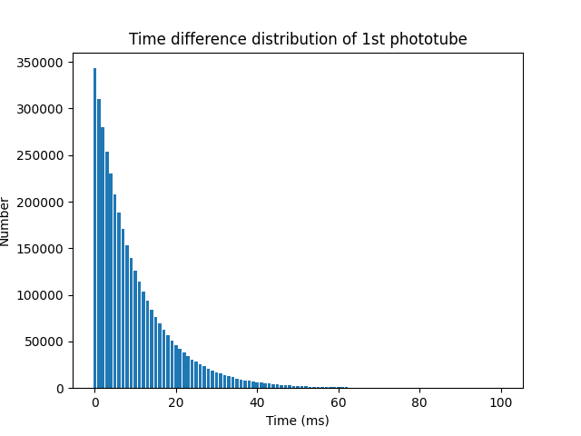
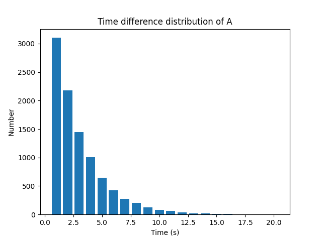
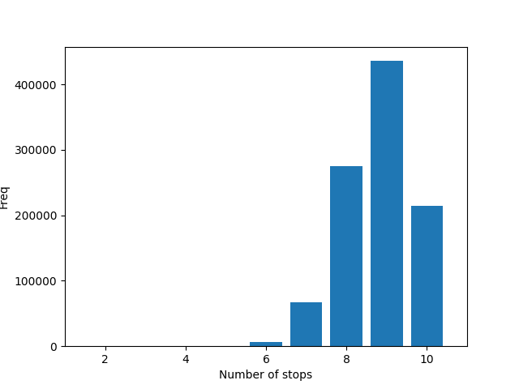
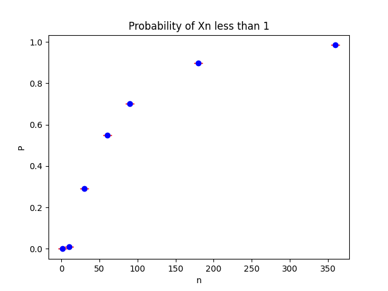

# Homework 2

Author: Wang Haozhe

Date: 2024/4/26

## Problem 1

### Code:
```python
#!/usr/local/bin/python3.11
# -*- coding: UTF-8 -*-
# @Project : Statistic
# @File    : Problem1.py
# @Author  : Albert Wang
# @Time    : 2024/4/22
# @Brief   : None

import numpy as np
from matplotlib import pyplot as plt


def calculate_diff(array_, lower_limit_, upper_limit_, step_):
    len_ = int((upper_limit_ - lower_limit_) / step_)
    t_ = np.linspace(lower_limit_ + step_, upper_limit_, len_)
    diff_ = np.diff(array_, axis=0)
    diff_.sort()
    n_ = np.zeros(len_)
    # Calculate the distribution
    i, j = 0, 0
    last_j = 0
    while i < t_.shape[0] and j < diff_.shape[0]:
        if diff_[j] < lower_limit_ + (i + 1) * step_:
            j += 1
            if diff_[j - 1] < lower_limit_ + i * step_:
                last_j = j
        else:
            n_[i] = j - last_j
            i += 1
            last_j = j
    return t_, n_


# Question 1 Begin
lambda_1 = 100
lambda_2 = 200
total_time = 36000
tau = 1e-5

# Generate event time series
events_1 = np.random.exponential(1 / lambda_1, total_time * lambda_1)
events_2 = np.random.exponential(1 / lambda_2, total_time * lambda_2)

# Convert event series to time series
time_series_1 = np.cumsum(events_1)
time_series_2 = np.cumsum(events_2)

# Plot histogram
t, n = calculate_diff(time_series_1, 0.000, 0.100, 1e-3)  # 1-100ms
plt.xlabel("Time (ms)")
plt.ylabel("Number")
plt.title("Time difference distribution of 1st phototube")
plt.bar(t * 1e3, n, color="#1f77b4")
plt.show()
# Question 1 End

# Question 2 Begin
event_a = []
i, j = 0, 0
while i < time_series_1.shape[0] and j < time_series_2.shape[0]:
    time_diff_ = abs(time_series_1[i] - time_series_2[j])
    if time_diff_ <= tau:
        event_a.append(min(time_series_1[i], time_series_2[j]))
    if time_series_1[i] < time_series_2[j]:
        i += 1
    else:
        j += 1
    print(i, j, time_diff_)
# Question 2 End

# Question 3 Begin
t_a, n_a = calculate_diff(event_a, 1, 20, 1)
plt.xlabel("Time (s)")
plt.ylabel("Number")
plt.title("Time difference distribution of A")
plt.bar(t_a, n_a, color="#1f77b4")
plt.show()
# Question 3 End

# Question 4 Begin
print("Event A number: ", len(event_a))
# Question 4 End
```

### Q1.


### Q3.


### Q4.
Event A number:  14386
Event A rate: 0.3996Hz
Theroetical rate: $2 \lambda_{1}\lambda_{2}\tau$ = 0.4Hz

## Problem 2

### Code:
```python
#!/usr/local/bin/python3.11
# -*- coding: UTF-8 -*-
# @Project : Statistic
# @File    : Problem2.py
# @Author  : Albert Wang
# @Time    : 2024/4/22
# @Brief   : None

import numpy as np
from matplotlib import pyplot as plt

count = []
result = []

for _ in range(100000):
    random_sequence = np.random.randint(low=1, high=11, size=20)

    num = 0
    for i in range(1, 10 + 1):
        if i in random_sequence:
            num += 1
    count.append(num)

for i in range(10):
    result.append(count.count(i + 1))

x = np.linspace(1, 10, 10)
plt.xlabel("Number of stops")
plt.ylabel("Freq")
plt.xlim(1, 11)
plt.bar(x, result, color="#1f77b4")
plt.show()

print(sum(count) / len(count))
```

Average stop number: 8.783095

## Problem 3
### Code:
```python
#!/usr/local/bin/python3.11
# -*- coding: UTF-8 -*-
# @Project : Statistic
# @File    : Problem3.py
# @Author  : Albert Wang
# @Time    : 2024/4/22
# @Brief   : None

import matplotlib.pyplot as plt
import numpy as np

# n = [1, 10, 30, 60]
# attempt = 100000000
# Result: [109.997606, 259.38078296321333, 1753.8927671964461, 26830.639793920483]

n = [1, 10, 30, 60, 90, 180, 360]
attempt = 1000000
price = []
price_less_than_one_prob = []
price_less_than_one_std = []

for i in n:
    price_n = np.full(attempt, 100.0)
    for j in range(i):
        random_sequence = np.random.choice([1.7, 0.5], size=attempt)
        price_n *= random_sequence
        print(i, j)
    price.append(np.mean(price_n))
    p_ = np.sum(price_n < 1) / attempt
    price_less_than_one_prob.append(p_)
    price_less_than_one_std.append(1.96 * np.sqrt(p_ * (1 - p_)) / attempt)

plt.errorbar(
    n,
    price_less_than_one_prob,
    yerr=price_less_than_one_std,
    fmt="o",
    color="blue",
    ecolor="red",
    capsize=5,
)
plt.xlabel("n")
plt.ylabel("P")
plt.title("Probability of Xn less than 1")
plt.show()
```

### Q1.
According to the CLT, when n tends to infinity, the distribution of $log(X_{n})$ will approach a normal distribution.

$$
\begin{align*}
E(\Delta logX_{n}) = \ & 0.5 \cdot [log(1.7)+log(0.5)] \\
Var(\Delta logX_{n}) = \ & 0.5 \cdot \{[log(1.7)-E(\Delta logX_{n})]^2 \\
&+ [log(0.5)-E(\Delta logX_{n})]^2\}
\end{align*}
$$

Therefore, $E(logX_{n}) = nE(\Delta logX_{n})$, $Var(logX_{n}) = nVar(\Delta logX_{n})$.
### Q2.
When n tends to infinity, since $0.5 \cdot 1.7 + 0.5 \cdot 0.5 = 1.1 > 1$, $E(X_{n})$ will tend to infinity.
### Q3.
According to Q2, $X_{n}$ will tend to infinity.
### Q4.
|$n$|1|10|30|60|
|---|---|---|---|---|
|$\bar{x_{n}}$|109.99760|259.38078|1753.89277|26830.63979|

### Q5.

