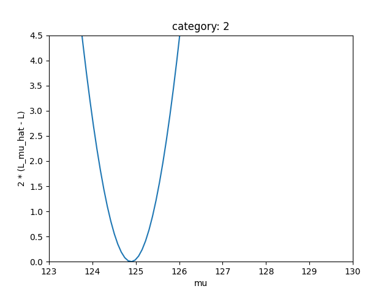

# Homework 3

Author: Wang Haozhe

Date: 2024/5/29

## Problem 1

### Code:
```python
#!/usr/local/bin/python3.11
# -*- coding: UTF-8 -*-
# @Project : Statistic
# @File    : Problem1.py
# @Author  : Albert Wang
# @Time    : 2024/5/27
# @Brief   : None

import numpy as np
import scipy as sp
import matplotlib.pyplot as plt

c_inv = sp.integrate.quad(lambda x: x ** (-4.5), 100, 180)[0]

ns = [48, 462, 704, 594, 11, 11, 35]
nb = [1520, 66180, 201599, 257028, 123, 382, 2238]
sigma = [1.4, 1.5, 2.0, 2.7, 1.6, 1.6, 1.7]


def pdfb(x_):
    return 1 / c_inv * x_ ** (-4.5)


def pdfs(x_, mu_, sigma_):
    return 1 / (sigma_ * np.sqrt(2 * np.pi)) * np.exp(-((x_ - mu_) ** 2) / (2 * sigma_ ** 2))


def lnL(mu_, data_, ns_, nb_, sigma_):
    y_ = 0
    for i in range(len(data_)):
        y_ += np.log(
            ns_ / (ns_ + nb_) * pdfs(data_[i], mu_, sigma_)
            + nb_ / (ns_ + nb_) * pdfb(data_[i])
        )
    return y_


def scan(data_, ns_, nb_, sigma_):
    mu_ = np.linspace(120, 130, 10000)
    lnL_mu_ = lnL(mu_, data_, ns_, nb_, sigma_)

    mu_hat_ = mu_[np.argmax(lnL_mu_)]
    lnL_mu_hat_ = lnL_mu_[np.argmax(lnL_mu_)]

    start_, end_ = 0, 0
    for i_ in range(10000 - 1):
        if 2 * (lnL_mu_hat_ - lnL_mu_[i_]) > 1 > 2 * (lnL_mu_hat_ - lnL_mu_[i_ + 1]):
            start_ = mu_[i_]
        elif 2 * (lnL_mu_hat_ - lnL_mu_[i_]) < 1 < 2 * (lnL_mu_hat_ - lnL_mu_[i_ + 1]):
            end_ = mu_[i_]

    return mu_hat_, start_, end_


mu = np.linspace(100, 180, 1000)
lnLz_mu = np.zeros(1000)
for j in range(7):
    data = np.loadtxt("./mggdata20240513/mgg_cms2020_cat" + str(j) + ".txt")
    lnL_mu = lnL(mu, data, ns[j], nb[j], sigma[j])
    mu_hat, start, end = scan(data, ns[j], nb[j], sigma[j])
    lnL_mu_hat = lnL(mu_hat, data, ns[j], nb[j], sigma[j])
    print("category: ", j, "mu_hat: ", mu_hat, "68.3% CLlength", end - start)

    plt.plot(mu, 2 * (lnL_mu_hat - lnL_mu))
    plt.xlabel("mu")
    plt.ylabel("2 * (L_mu_hat - L)")
    plt.xlim(123, 130)
    plt.ylim(0, 4.5)
    plt.title("category: " + str(j))
    plt.show()

    lnLz_mu = np.add(lnLz_mu, lnL_mu)


plt.plot(mu, lnLz_mu)
mu_hat = mu[np.argmax(lnLz_mu)]
lnLz_mu_hat = lnLz_mu[np.argmax(lnLz_mu)]
start, end = 0, 0
for i in range(1000 - 1):
    if 2 * (lnLz_mu_hat - lnLz_mu[i]) > 1 > 2 * (lnLz_mu_hat - lnLz_mu[i + 1]):
        start = mu[i]
    elif 2 * (lnLz_mu_hat - lnLz_mu[i]) < 1 < 2 * (lnLz_mu_hat - lnLz_mu[i + 1]):
        end = mu[i]
print("category: Lz", "mu_hat: ", mu[np.argmax(lnLz_mu)], "68.3% CLlength", end - start)

plt.plot(mu, 2 * (lnLz_mu_hat - lnLz_mu))
plt.xlabel("mu")
plt.ylabel("2 * (L_mu_hat - L)")
plt.xlim(123, 130)
plt.ylim(0, 4.5)
plt.title("category: Lz")
plt.show()
```

### Results
|Category|$\hat{\mu}$|68.3% CL length|
|---|---|---|
0 | 126.32563256325632 | 0.9020902090208978
1 | 125.84358435843585 | 0.7300730073007315
2 | 124.89148914891489 | 1.0421042104210443
3 | 126.71667166716672 | 2.2662266226622734
4 | 126.26662666266627 | 1.573157315731578
5 | 125.6045604560456 | 2.277227722772267
6 | 125.18751875187519 | 1.3551355135513603
Lz | 125.78578578578579 | 0.40040040040041447

Category 0, 1 and 2 have the smallest 68.3% CL length, thus they are the most accuracy results among the seven categories.
These categories result in Lz with μ=125.78 and σ=0.40.

The curves are shown below.





## Problem 2

### Code:
```python
#!/usr/local/bin/python3.11
# -*- coding: UTF-8 -*-
# @Project : Statistic
# @File    : Problem2.py
# @Author  : Albert Wang
# @Time    : 2024/5/28
# @Brief   : None

import numpy as np
import matplotlib.pyplot as plt
import scipy.special as special


def coverage_prob(s_, method):
    b_ = 3.2
    n_ = np.random.poisson(s_ + b_, 1000000)
    s_up_ = 0
    if method == "classical":
        s_up_ = 0.5 * special.chdtri(2 * (n_ + 1), 0.1) - b_
    elif method == "bayesian":
        s_up_ = 0.5 * special.chdtri(2 * (n_ + 1), 0.1 * (special.chdtrc(2 * (n_ + 1), 2 * b_))) - b_
    p_ = np.count_nonzero(s_up_ > s_) / 1000000
    return p_


p_classical = np.array([])
p_bayesian = np.array([])
s = np.linspace(0.1, 20, 200)
for i in s:
    p_classical = np.append(p_classical, coverage_prob(i, method="classical"))
    p_bayesian = np.append(p_bayesian, coverage_prob(i, method="bayesian"))

plt.plot(s, p_classical, color="#1f77b4", label="Classical")
plt.plot(s, p_bayesian, color="#ff7f0e", label="Bayesian")
plt.xlabel("s")
plt.ylabel("p")
plt.title("Coverage probability of 90% confidence interval for s")
plt.legend()
plt.show()
```

### Result


The coverage rates of both show oscillations. This is due to the Poisson distribution results in integers. The Bayesian method has a higher accuracy when s is small. This is because Bayesian theory rejects the unrealistic situation of s < 0. As the expectation of s increases, the coverage rates of the s_up for the two methods gradually converge to the same value. This is because as the expectation of s increases, the corresponding impact of b becomes smaller.
